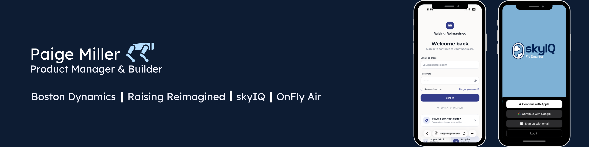

  

---

I supported physical AI integration of robotic trailer-loading at FedEx and authored the executive whitepaper that launched FedEx's humanoid robotics RFI process. Before that, I launched the first Wing drone delivery site in Frisco, TX and supported the expansion of last mile drone delivery across 50+ Walmart stores and spearheaded UAS and eVTOL integration at UPS. Now I'm at Boston Dynamics on the Spot team, focused on Next Bets — finding new ways to put the BD product family to work solving real problems.

Outside of work, I co-found companies. I believe the best PMs can go from whiteboard to working prototype — so I started building.

---

## Companies I Co-Founded

| | Company | What It Is | Status |
|---|---------|-----------|--------|
| ✈️ | [**SkyIQ**](https://www.skyiq.net) | Fuel planning & optimization for Part 135 aviation — AI parsing + Modified Dijkstra's | [Live App](https://app.skyiq.net) · Patent Pending |
| 🛍️ | [**Raising Reimagined**](https://raisingreimagined.com) | No-cost fundraising platform — 198 campaigns, $127K raised in 2024, ~5K users | [Live App](https://app.raisingreimagined.com) |
| 🛩️ | [**OnFly Air**](https://onflyair.com) | On-demand air charter brokerage — nationwide, 24/7 | [Live Site](https://onflyair.com) |

## PM Portfolio

Deep-dive case studies with real product artifacts — architecture diagrams, wireframes, brand systems, app screenshots, and strategic frameworks.

| Repo | Highlights |
|------|-----------|
| [**raising-reimagined-portfolio**](https://github.com/paige-millz/raising-reimagined-portfolio) | Three-sided marketplace design · Stripe Connect architecture · Go-to-market strategy · Live app screenshots |
| [**skyiq-portfolio**](https://github.com/paige-millz/skyiq-portfolio) | Modular system architecture · AI parsing + optimization flow · Brand identity I designed · UX wireframes |

## Code Projects

| Repo | What I Built | Stack |
|------|-------------|-------|
| [**flyfit-buddy**](https://github.com/paige-millz/flyfit-buddy) | Air cargo fit calculator — checks if cargo fits through doors/cabins using real aircraft specs | React · TypeScript · Vite |
| [**bulb-forecast-ai**](https://github.com/paige-millz/bulb-forecast-ai) | Predicts optimal bulb removal timing using Growing Degree Days + Easter regression | React · TypeScript · Supabase |
| [**photo-journal-app**](https://github.com/paige-millz/photo-journal-app) | Photo journal with EXIF auto-parsing, film recipe tracking & camera metadata | Next.js · Supabase |

---

<strong>Career Timeline</strong>

 

- **Boston Dynamics** — Product Manager, Spot (Next Bets Initiatives)
- **FedEx** — Analyst, OTI Physical AI · Robotic trailer-loading, authored humanoid robotics whitepaper
- **Walmart** — Senior Manager, Automation Engineering · Supporting Walmart's drone delivery expansion
- **UPS Flight Forward** — Management Engineering Lead, Strategy R&D · UAS/robotics/AI integration
- **Liberty University** — B.S. Aeronautics (UAS Cognate) · Top Aerospace Technology Student 2020 · D1 Track & Field · Summa Cum Laude
- Private Pilot · FAA Part 107 Remote Pilot

